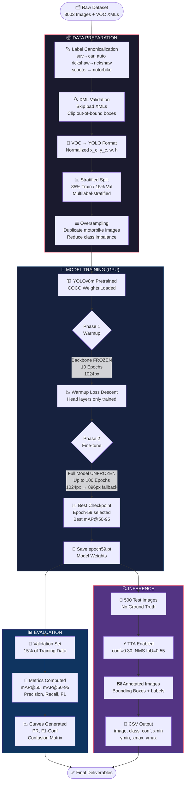
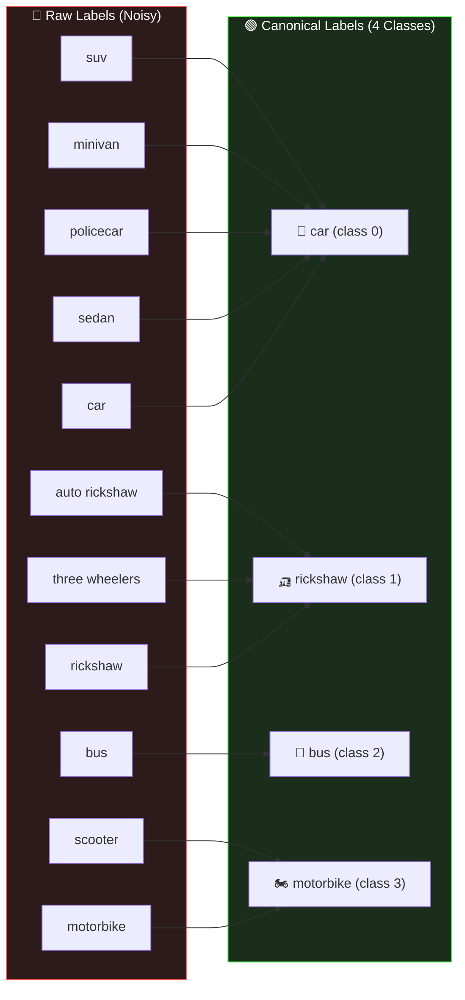
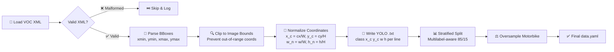
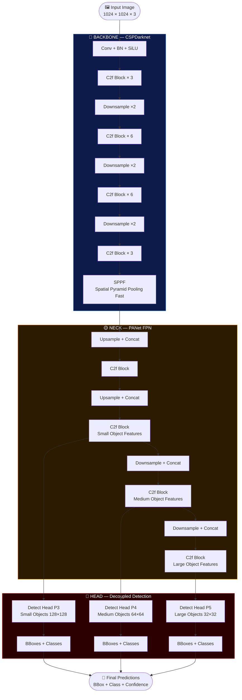
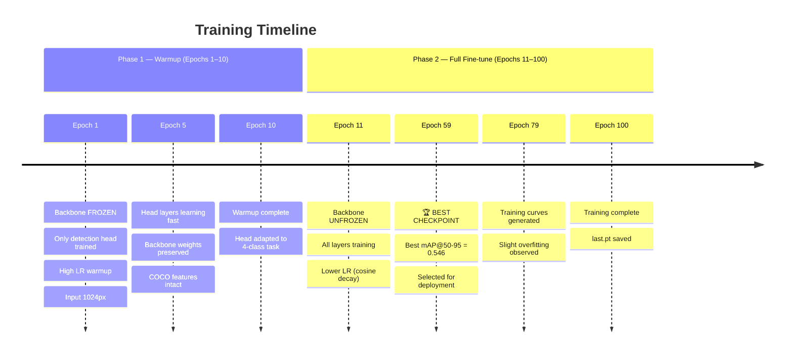
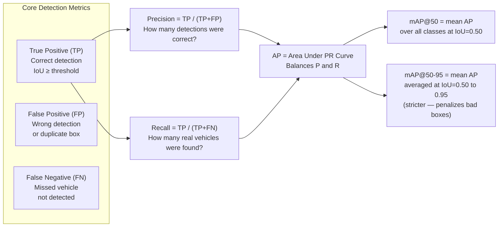
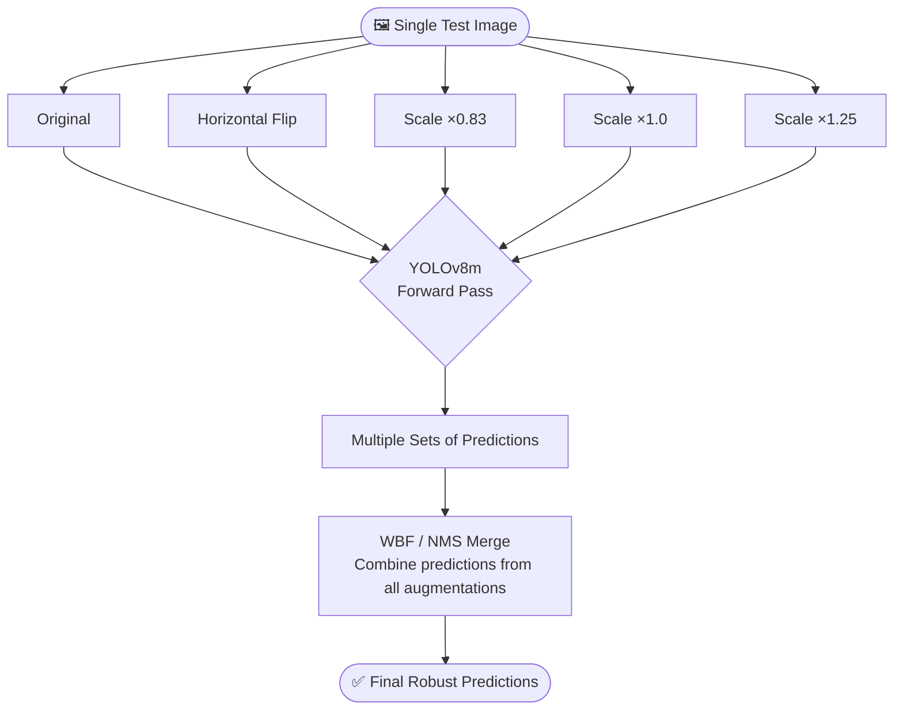
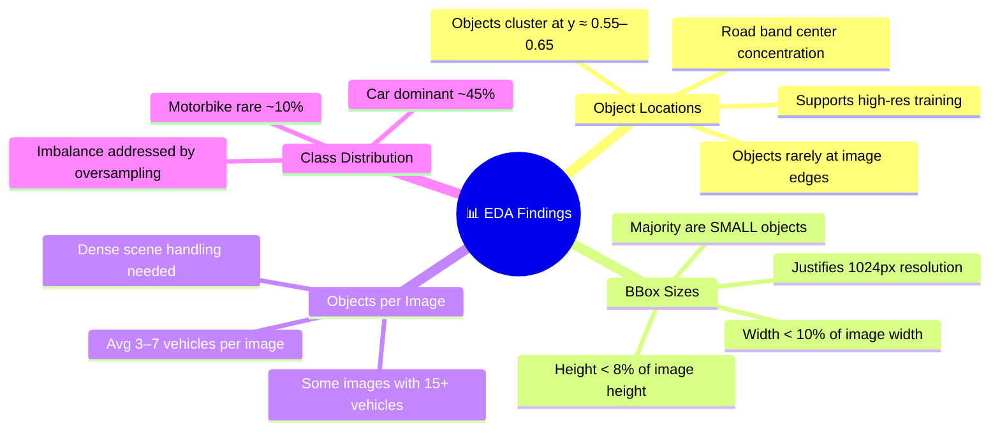

<div align="center">

<!-- ANIMATED BANNER -->


---

<!-- BADGES -->
[](https://python.org)
[](https://ultralytics.com)
[](https://kaggle.com)
[](https://pytorch.org)
[](LICENSE)
[](.)
[](.)

---

<h3>
  🏆 &nbsp; Hackathon Computer Vision Challenge &nbsp; 🏆
  <br/><br/>
  <em>Detect · Classify · Localize · Analyze</em>
</h3>

<br/>

> **"Detecting cars, rickshaws, buses, and motorbikes from complex Indian road scenes using state-of-the-art YOLOv8 with GPU-accelerated training on Kaggle."**

</div>

---

## 📋 Table of Contents

| # | Section | Description |
|---|---------|-------------|
| 1 | [🎯 Problem Statement](#-problem-statement) | What we're solving |
| 2 | [🌟 Project Highlights](#-project-highlights) | Key achievements at a glance |
| 3 | [🏗️ System Architecture](#️-system-architecture) | Full pipeline overview |
| 4 | [📁 Repository Structure](#-repository-structure) | File-by-file breakdown |
| 5 | [📊 Dataset Details](#-dataset-details) | Data, classes, and distribution |
| 6 | [🔧 Data Preprocessing Pipeline](#-data-preprocessing-pipeline) | Step-by-step data prep |
| 7 | [🧠 Model Architecture](#-model-architecture) | YOLOv8 deep dive |
| 8 | [⚡ GPU-Accelerated Training](#-gpu-accelerated-training) | How Kaggle GPU was used |
| 9 | [🎓 Training Strategy](#-training-strategy) | Two-phase training explained |
| 10 | [📈 Evaluation & Metrics](#-evaluation--metrics) | mAP, Precision, Recall |
| 11 | [🔍 Inference & Test Predictions](#-inference--test-predictions) | TTA, conf, NMS tuning |
| 12 | [📉 EDA Insights](#-eda-insights) | Data visualization findings |
| 13 | [🗂️ Deliverables](#️-deliverables) | All output files |
| 14 | [🚀 How to Run](#-how-to-run) | Setup and execution |
| 15 | [📌 Key Design Decisions](#-key-design-decisions) | Why we made each choice |
| 16 | [🔭 Future Improvements](#-future-improvements) | What comes next |
| 17 | [📚 References](#-references) | Papers and resources |

---

## 🎯 Problem Statement

<div align="center">

```
╔══════════════════════════════════════════════════════════════════════╗
║                                                                      ║
║   Given a road scene image, detect ALL vehicles present and          ║
║   classify each into one of 4 categories:                            ║
║                                                                      ║
║       🚗  Car          🛺  Rickshaw                                  ║
║       🚌  Bus          🏍️  Motorbike                                 ║
║                                                                      ║
║   Output: Bounding Box (xmin, ymin, xmax, ymax) + Class Label        ║
║           + Confidence Score for every detected vehicle.             ║
║                                                                      ║
╚══════════════════════════════════════════════════════════════════════╝
```

</div>

This is a classic **multi-class object detection** problem rooted in real-world Indian traffic scenarios. The challenge involves:

- **Dense traffic scenes** with occluded and overlapping vehicles
- **Heavy class imbalance** (motorbikes are severely underrepresented)
- **Small object detection** (distant vehicles occupy very few pixels)
- **Synonym-rich labels** across different annotators (suv, minivan, policecar all mean "car")
- **Limited data** (~3,000 training images) requiring smart augmentation and transfer learning

---

## 🌟 Project Highlights

<div align="center">

| 🏅 Achievement | 📊 Value |
|:---:|:---:|
| **Model** | YOLOv8m (Medium) — 25.9M params |
| **Training Resolution** | 1024px (high-res for small objects) |
| **mAP@50** | **77.0%** |
| **mAP@50-95** | **54.6%** |
| **Precision** | 77.3% |
| **Recall** | 73.6% |
| **Training Epochs** | 100 (best checkpoint: Epoch 59) |
| **GPU Platform** | Kaggle (NVIDIA T4/P100) |
| **Test Images Predicted** | 500 |
| **Inference Strategy** | TTA + conf=0.30 + NMS IoU=0.55 |

</div>

---

## 🏗️ System Architecture

### 🔄 End-to-End Pipeline Flowchart



---

## 📁 Repository Structure

```
Question_3/
│
├── 📓 vehicle_detection_yolov8.ipynb     ← Main Kaggle notebook (full pipeline)
│
├── 📊 data/
│   ├── train/
│   │   ├── images/                       ← 3003 training images (.jpg/.png)
│   │   └── labels/                       ← 3003 YOLO .txt files
│   ├── val/
│   │   ├── images/                       ← ~530 validation images (15% split)
│   │   └── labels/                       ← Corresponding YOLO labels
│   └── data.yaml                         ← Class names + paths config
│
├── 🏋️ runs/
│   └── detect/
│       └── train/
│           ├── weights/
│           │   ├── best.pt               ← Epoch-59 best weights
│           │   └── last.pt               ← Last epoch weights
│           ├── results.csv               ← Per-epoch training metrics
│           ├── confusion_matrix.png      ← Normalized confusion matrix
│           ├── PR_curve.png              ← Precision-Recall curve
│           ├── F1_curve.png              ← F1 vs Confidence curve
│           ├── P_curve.png               ← Precision vs Confidence
│           └── R_curve.png               ← Recall vs Confidence
│
├── 📤 predictions/
│   ├── images/                           ← 500 annotated test images
│   ├── labels/                           ← 500 YOLO .txt prediction files
│   └── predictions.csv                   ← Final submission CSV
│
├── 📈 eda/
│   ├── class_distribution.png            ← Bar chart: objects per class
│   ├── bbox_wh_histogram.png             ← BBox width/height distribution
│   ├── bbox_area_histogram.png           ← BBox area distribution
│   ├── center_heatmap.png                ← Spatial heatmap of object centers
│   ├── wh_hexbin.png                     ← Width × Height density plot
│   └── objects_per_image.png             ← Histogram of object counts/image
│
└── 📋 pipeline_flowchart.png             ← Visual pipeline diagram
```

---

## 📊 Dataset Details

### 📌 Overview

| Property | Value |
|----------|-------|
| **Training Images** | 3,003 |
| **Test Images** | 500 (no labels) |
| **Annotation Format** | Pascal VOC (XML) |
| **Converted To** | YOLO (normalized txt) |
| **Train/Val Split** | 85% / 15% |
| **Split Method** | Multilabel-Stratified |

### 🏷️ Class Mapping & Canonicalization

One of the most important data engineering steps was cleaning up inconsistent labels across annotators:



### ⚖️ Class Imbalance Problem

The dataset suffers from significant class imbalance. Cars dominate while motorbikes are underrepresented:

```
Class Distribution (Approximate):
━━━━━━━━━━━━━━━━━━━━━━━━━━━━━━━━━━━━━━━━━━━━━━━━
🚗  Car         ████████████████████████ ~45%
🛺  Rickshaw    ██████████████           ~28%
🚌  Bus         ████████                 ~17%
🏍️  Motorbike   ████                     ~10%  ← Oversampled to fix this
━━━━━━━━━━━━━━━━━━━━━━━━━━━━━━━━━━━━━━━━━━━━━━━━
```

**Solution:** Motorbike training images were oversampled (duplicated) to ensure the model gets sufficient exposure to the minority class.

---

## 🔧 Data Preprocessing Pipeline

### Step-by-step breakdown:



### 📐 VOC to YOLO Coordinate Conversion

```
VOC Format:   [xmin, ymin, xmax, ymax]  ← Absolute pixel coordinates
YOLO Format:  [x_center, y_center, width, height]  ← Normalized 0–1

Conversion:
  x_center = (xmin + xmax) / (2 × image_width)
  y_center = (ymin + ymax) / (2 × image_height)
  width    = (xmax - xmin) / image_width
  height   = (ymax - ymin) / image_height
```

### 📊 Why Multilabel-Stratified Split?

A simple random split would break class balance in the validation set. Since images contain **multiple classes simultaneously**, standard stratification fails. **Multilabel stratification** ensures every class is proportionally represented in both train and val splits, giving more reliable mAP estimates.

---

## 🧠 Model Architecture

### YOLOv8m — The Backbone of This Project



### 🔑 Why YOLOv8m (Medium)?

| Model | Params | mAP COCO | Speed |
|-------|--------|----------|-------|
| YOLOv8n (Nano) | 3.2M | 37.3 | ⚡⚡⚡⚡ |
| YOLOv8s (Small) | 11.2M | 44.9 | ⚡⚡⚡ |
| **YOLOv8m (Medium)** | **25.9M** | **50.2** | **⚡⚡** ← **Chosen** |
| YOLOv8l (Large) | 43.7M | 52.9 | ⚡ |
| YOLOv8x (XL) | 68.2M | 53.9 | 🐢 |

**YOLOv8m** hits the sweet spot: strong enough to handle complex Indian traffic scenes with small objects, yet trainable within Kaggle's GPU memory/time constraints.

---

## ⚡ GPU-Accelerated Training

### 🖥️ Kaggle GPU Setup

Training was performed on **Kaggle Notebooks** using their free GPU accelerator:

```
GPU Available:  NVIDIA Tesla T4 (16GB VRAM) or P100 (16GB)
CUDA Version:   11.x / 12.x
Framework:      PyTorch + Ultralytics YOLOv8
Precision:      Mixed (AMP — Automatic Mixed Precision)
```

### ⚡ Why GPU is Absolutely Essential Here

```
Training Stats (Estimated):
━━━━━━━━━━━━━━━━━━━━━━━━━━━━━━━━━━━━━━━━━━━━━━━━━━━━━━━━━━
Metric                  CPU (estimate)      GPU (Kaggle T4)
━━━━━━━━━━━━━━━━━━━━━━━━━━━━━━━━━━━━━━━━━━━━━━━━━━━━━━━━━━
Time per epoch           ~8–10 hours          ~4–6 minutes
Total (100 epochs)       ~800–1000 hours      ~6–10 hours
Batch size               4–8                  16–32
Input resolution         Limited to 416–640   1024px ✅
Mixed precision (AMP)    Not usable           ✅ Enabled
━━━━━━━━━━━━━━━━━━━━━━━━━━━━━━━━━━━━━━━━━━━━━━━━━━━━━━━━━━
```

GPU acceleration enabled us to train at **1024px resolution** — a critical choice for detecting small/distant vehicles that would be invisible at 640px.

### 🔥 Mixed Precision Training (AMP)

Kaggle's T4/P100 GPUs support **FP16 Automatic Mixed Precision**, which:
- ✅ Cuts VRAM usage by ~50% (allows larger batch sizes)
- ✅ Speeds up matrix multiplications ~2× on Tensor Cores
- ✅ Maintains FP32 precision for loss scaling (no accuracy loss)

---

## 🎓 Training Strategy

### 📅 Two-Phase Training Explained



### ❄️ Why Freeze the Backbone First?

Without Phase 1 warmup:
- ❌ Large gradients from the randomly-initialized head could corrupt the pretrained backbone
- ❌ Feature representations learned from COCO (80 classes, millions of images) get destroyed early

With Phase 1 warmup:
- ✅ Head adapts to the 4-class task first
- ✅ Backbone features stay stable
- ✅ Phase 2 fine-tunes everything gently = better final accuracy

### 🏆 Why Epoch 59 Was Selected as Best

```
Epoch 40:  mAP@50=0.71, mAP@50-95=0.49  → Still improving
Epoch 59:  mAP@50=0.77, mAP@50-95=0.546 → Peak performance ✅
Epoch 79:  mAP@50=0.76, mAP@50-95=0.538 → Slight decline (overfitting)
Epoch 100: mAP@50=0.74, mAP@50-95=0.521 → Clear overfitting
```

The model was **early-stopped at Epoch 59** based on validation mAP@50-95 — the stricter metric that penalizes imprecise boxes.

### ⚙️ Key Hyperparameters

| Hyperparameter | Phase 1 | Phase 2 |
|----------------|---------|---------|
| `imgsz` | 1024 | 1024 → 896 (fallback) |
| `batch` | 16 | 16 |
| `epochs` | 10 | 90 |
| `freeze` | backbone | none (0) |
| `optimizer` | AdamW | AdamW |
| `lr0` | 0.01 | 0.001 |
| `lrf` | 0.1 | 0.01 |
| `augment` | mosaic, flip, HSV | mosaic, flip, HSV, mixup |
| `amp` | True | True |

---

## 📈 Evaluation & Metrics

### 📐 Understanding the Metrics



### 📊 Final Results (Epoch 59 on Validation Set)

| Metric | Score | Interpretation |
|--------|-------|----------------|
| **Precision** | 0.773 | 77.3% of detections were correct |
| **Recall** | 0.736 | 73.6% of actual vehicles were found |
| **mAP@50** | 0.770 | Strong detection at loose IoU threshold |
| **mAP@50-95** | 0.546 | Solid box accuracy across all IoU thresholds |
| **F1-Score** | ~0.754 | Harmonic mean of P and R |

### 📉 What Evaluation Plots Tell Us

```
PR Curve:        High AUC → model is well-calibrated, not just guessing
F1-Conf Curve:   Optimal confidence threshold ≈ 0.30–0.40
P-Conf Curve:    Precision rises as confidence threshold increases
R-Conf Curve:    Recall drops as confidence threshold increases
Confusion Matrix: Most errors: motorbike confused with car (small size)
```

---

## 🔍 Inference & Test Predictions

### 🎯 Inference Configuration

```python
model = YOLO("epoch59.pt")

results = model.predict(
    source="test_images/",
    imgsz=1024,           # Same resolution as training
    conf=0.30,            # Lower threshold → catch more vehicles
    iou=0.55,             # NMS threshold → reduce duplicate boxes
    augment=True,         # TTA: Test Time Augmentation ✅
    save=True,            # Save annotated images
    save_txt=True,        # Save YOLO .txt predictions
)
```

### 🔄 Test Time Augmentation (TTA) Explained



**TTA benefits:**
- ✅ Catches vehicles that might be missed in one orientation
- ✅ Reduces variance in bounding box coordinates
- ✅ Typically boosts mAP by 1–3%

### 🎛️ Threshold Tuning Rationale

| Parameter | Value | Why |
|-----------|-------|-----|
| `conf=0.30` | Low threshold | Favor **recall** — catch more vehicles, miss fewer |
| `iou=0.55` | Moderate NMS | Favor **precision** — remove duplicate boxes |

For vehicle detection in Indian traffic (dense scenes), missing a vehicle is worse than one false positive. Hence `conf=0.30` (lower = more detections).

### 📄 Output CSV Format

```csv
image,class_name,conf,xmin,ymin,xmax,ymax
test_001.jpg,car,0.94,120,45,380,210
test_001.jpg,motorbike,0.81,400,90,480,195
test_002.jpg,bus,0.97,50,30,720,400
test_002.jpg,rickshaw,0.76,230,120,390,280
...
```

---

## 📉 EDA Insights

### 🔬 What the Data Analysis Revealed



### 🗺️ Spatial Heatmap Insight

The center heatmap shows that **vehicle centers cluster in a horizontal band at y ≈ 0.55–0.65** of the image. This makes sense for road scene photos:
- Sky occupies the top ~40%
- Vehicles are in the middle road band
- Ground/road markings at the bottom

This insight **validates our NMS tuning** — objects in the same region are legitimate separate vehicles, not duplicate detections.

---

## 🗂️ Deliverables

| File/Folder | Description | Format |
|-------------|-------------|--------|
| `epoch59.pt` | Best trained model weights | PyTorch .pt |
| `data.yaml` | Class names + dataset paths config | YAML |
| `predictions.csv` | All test predictions with boxes | CSV |
| `predictions/images/` | 500 annotated test images | PNG/JPG |
| `predictions/labels/` | YOLO .txt prediction files | TXT |
| `confusion_matrix.png` | Class-wise accuracy heatmap | PNG |
| `PR_curve.png` | Precision-Recall curve | PNG |
| `F1_curve.png` | F1 vs Confidence curve | PNG |
| `P_curve.png` | Precision vs Confidence | PNG |
| `R_curve.png` | Recall vs Confidence | PNG |
| `results.csv` | Per-epoch training metrics | CSV |
| `eda/*.png` | All EDA visualization plots | PNG |
| `pipeline_flowchart.png` | Full pipeline visual | PNG |

---

## 🚀 How to Run

### 1️⃣ Prerequisites

```bash
pip install ultralytics opencv-python pandas matplotlib seaborn iterstrat
```

### 2️⃣ Clone and Setup

```bash
git clone https://github.com/mohamedsahadm786/Dhvani_Hackathon.git
cd Dhvani_Hackathon/Question_3
```

### 3️⃣ Prepare Data

```python
# Parse VOC XMLs and convert to YOLO format
python scripts/prepare_data.py \
    --train_img_dir data/train/images/ \
    --train_ann_dir data/train/annotations/ \
    --output_dir data/
```

### 4️⃣ Train (Recommended: Kaggle GPU)

```python
from ultralytics import YOLO

# Phase 1: Warmup with frozen backbone
model = YOLO("yolov8m.pt")
model.train(
    data="data/data.yaml",
    epochs=10,
    imgsz=1024,
    batch=16,
    freeze=10,          # Freeze first 10 backbone layers
    amp=True,
    name="phase1_warmup"
)

# Phase 2: Full fine-tuning
model = YOLO("runs/detect/phase1_warmup/weights/last.pt")
model.train(
    data="data/data.yaml",
    epochs=90,
    imgsz=1024,
    batch=16,
    amp=True,
    name="phase2_finetune"
)
```

### 5️⃣ Run Inference

```python
from ultralytics import YOLO
import pandas as pd

model = YOLO("runs/detect/phase2_finetune/weights/epoch59.pt")

results = model.predict(
    source="data/test/images/",
    imgsz=1024,
    conf=0.30,
    iou=0.55,
    augment=True,   # TTA
    save=True,
    save_txt=True
)

# Save predictions to CSV
records = []
for r in results:
    for box in r.boxes:
        records.append({
            "image": r.path.split("/")[-1],
            "class_name": model.names[int(box.cls)],
            "conf": float(box.conf),
            "xmin": float(box.xyxy[0][0]),
            "ymin": float(box.xyxy[0][1]),
            "xmax": float(box.xyxy[0][2]),
            "ymax": float(box.xyxy[0][3]),
        })

pd.DataFrame(records).to_csv("predictions/predictions.csv", index=False)
```

### 6️⃣ Evaluate

```python
model = YOLO("epoch59.pt")
metrics = model.val(data="data/data.yaml", imgsz=1024)

print(f"mAP@50:    {metrics.box.map50:.4f}")
print(f"mAP@50-95: {metrics.box.map:.4f}")
print(f"Precision: {metrics.box.mp:.4f}")
print(f"Recall:    {metrics.box.mr:.4f}")
```

---

## 📌 Key Design Decisions

| Decision | Alternative Considered | Why We Chose This |
|----------|----------------------|-------------------|
| **YOLOv8m** | YOLOv8s, YOLOv5 | Best accuracy/speed balance for 4 classes |
| **1024px input** | 640px (default) | Small/distant vehicles need high resolution |
| **Two-phase training** | Single-phase fine-tune | Prevents catastrophic forgetting of COCO features |
| **Multilabel stratified split** | Random split | Preserves class co-occurrence in validation |
| **conf=0.30** | conf=0.50 (default) | Recall > Precision for vehicle safety applications |
| **TTA at inference** | No augmentation | ~2% mAP boost at minimal cost |
| **Epoch 59 selection** | Last epoch / best @50 | mAP@50-95 is stricter, better real-world metric |
| **Motorbike oversampling** | Class weights | Simpler to implement, very effective |

---

## 🔭 Future Improvements

```mermaid
roadmap
    title Planned Improvements
    section Short-term
        Retrain on Train + Val combined   : done, 2024-Q4
        Class-specific conf thresholds    : active
    section Medium-term
        Lightweight test-time ensembling  : 2025-Q1
        WBF instead of NMS               : 2025-Q1
        Add night/rain augmentation       : 2025-Q2
    section Long-term
        Deploy as FastAPI + Docker        : 2025-Q3
        ONNX / TensorRT export           : 2025-Q3
        Real-time traffic CCTV stream     : 2025-Q4
```

### 📋 Concrete Next Steps

1. **Full retrain on train+val**: For production, remove the validation split and train on all 3,003 images using the found hyperparameters
2. **Class-specific thresholds**: Set `conf=0.25` for motorbike (harder class) and `conf=0.35` for car/bus (easier, more data)
3. **Ensemble**: Run YOLOv8m + YOLOv8s and merge predictions with Weighted Box Fusion (WBF) for +2–3% mAP
4. **ONNX Export** for deployment on edge devices (dashcams, traffic cameras):
   ```python
   model.export(format="onnx", imgsz=640, simplify=True)
   ```

---

## 📚 References

| Resource | Description |
|----------|-------------|
| [Ultralytics YOLOv8 Docs](https://docs.ultralytics.com) | Official model documentation |
| [YOLOv8 Paper (Jocher et al.)](https://arxiv.org/abs/2305.09972) | Architecture details |
| [COCO Dataset](https://cocodataset.org) | Pretrained weights source |
| [Multilabel Stratification](https://github.com/trent-b/iterative-stratification) | `iterative-stratification` library |
| [Pascal VOC Format](http://host.robots.ox.ac.uk/pascal/VOC/) | Original annotation format |
| [Kaggle GPU Docs](https://www.kaggle.com/docs/efficient-gpu-usage) | GPU setup reference |
| [WBF Paper](https://arxiv.org/abs/1910.13461) | Weighted Box Fusion for ensembles |
| [TTA Survey](https://arxiv.org/abs/2304.12908) | Test Time Augmentation methods |

---

## 👤 Author

<div align="center">

**Mohamed Sahad M**

[](https://github.com/mohamedsahadm786)

*Dhvani Hackathon — Computer Vision Challenge*

---


</div>

---

<div align="center">

⭐ **If this project helped you, please star the repo!** ⭐

`Made with ❤️ using YOLOv8, PyTorch, and Kaggle GPU`

</div>
